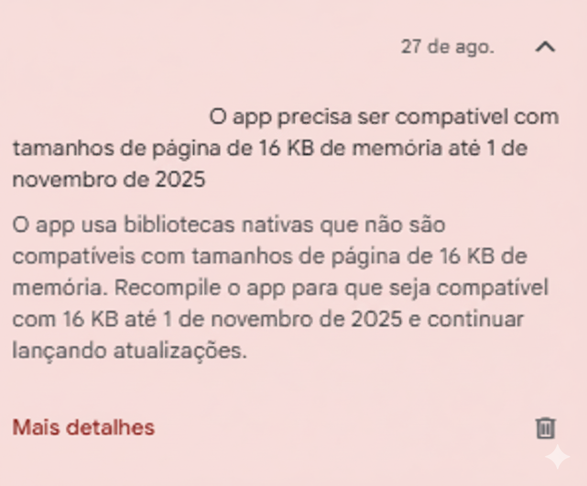

# How to prepare your Flutter app for Android's new 16KB policy (Google Play 2025)

Recently I had to adjust a Flutter app to meet Google Play's new **16KB page size** requirement.

In this article, I present a straight-to-the-point guide, showing the problem, the steps to reproduce it, and most importantly, the definitive solution to adjust your application.

## The problem



Starting **November 1st, 2025**, **Google Play will only accept apps that run on Android devices configured with 16 KB memory page size**.

The impact is direct on the **native libraries (`.so`)** that your app uses. If one of these libraries was compiled expecting only *4 KB (0x1000) alignment*, it will fail on modern 16 KB devices. The result? Your app might crash on startup with errors like *native library not loaded* or *couldn't map segment*.

In Flutter, this risk is high, as many popular dependencies — *like PDF readers, graphics libraries or Sentry* — include these .so files and might not be updated yet.

## How to Reproduce the Problem

Before risking a rejection on Google Play, the ideal is to simulate the environment that causes the error. The simplest way is to create an Android emulator that comes already configured with support for 16 KB page size.

###  Creating a test emulator: Steps in Android Studio

1. In the tools menu, go to Tools > AVD Manager.

2. Click on Create Virtual Device....

3. Choose a hardware (like the Pixel 9, for example) and click Next.

4. In the system image selection screen (System Image), look for and select an image that contains "16 KB Page Size" in its name. They are available for Android 15 (API 35) and above.

5. As shown in the image below, the name is quite explicit: Pre-Release 16 KB Page Size Google Play...

6. Click Next and Finish to create the emulator.

When running your app on this emulator, if it has any incompatible native library, the app will crash on startup, exactly reproducing the error that would happen on a physical device.


---

## Possible Errors: The Alert, the Crash and the Close

When running your app on the 16 KB emulator, incompatibility might manifest in different ways. The important thing is to know that all of them indicate the same root problem.

### 1. Compatibility Alert

This is the most "friendly" scenario and exactly what the image below shows. The emulator's operating system detects the incompatibility before crashing and displays a clear alert for the developer.

The message says:

> "This app isn't 16 KB compatible. ELF alignment check failed. This app will be run using page size compatible mode. For best compatibility, please recompile the application with 16 KB support."

This means that the emulator will try to force the execution of the app, but it **isn't approved** and will be rejected by Google Play or fail on real devices.


### 2. Crash with Error

This is the "classic" failure. The system tries to load the native library (`.so`), can't due to incorrect alignment, and the application breaks. When inspecting Logcat, you'll find an explicit fatal error, such as:

```
java.lang.UnsatisfiedLinkError: couldn't map segment from shared object
```

### 3. App Simply Closes

In some cases, especially in production builds (`release`), the app might simply close at the moment of startup without displaying a visible error message for the user. The cause is the same, but the diagnosis requires a deeper analysis of the device logs.

---

## The Solution: Step by Step

To solve the problem, you need to make three main adjustments to your Android module configuration files.

### 1\\. Enable 16 KB Support

In the file `android/gradle.properties`, add the following line at the end of the file. This is the main instruction that activates compilation with 16 KB support.

```properties
android.enable16kPages=true
```

### 2\\. Configure the Java Version

In the file `android/app/build.gradle`, make sure your project is configured to compile using at minimum **Java 11** (the recommendation is **Java 17**).

```gradle
android {
    // ... other configurations

    compileOptions {
        sourceCompatibility JavaVersion.VERSION_17
        targetCompatibility JavaVersion.VERSION_17
    }

    kotlinOptions {
        jvmTarget = JavaVersion.VERSION_17.toString()
    }
}
```

### 3\\. Specify the NDK Version

Still in `android/app/build.gradle`, inside the `android {}` block, specify an NDK (Native Development Kit) version equal to or higher than `26.1.10909125`. **In this example, I'm using `27.0.12077973`**, which is one of the most recent available in Android Studio.

```gradle
android {
    // ... other configurations

    ndkVersion "27.0.12077973"
}
```

With these three configurations applied, your project will be prepared to compile native libraries with the correct alignment.

---

## Finding Incompatible Libraries

With the build environment prepared, the critical part now is to investigate native libraries. We need to identify exactly which `.so` files are misaligned. Doing this manually in a large project would be unfeasible.

To solve this, **I created a script that automates the extraction and auditing**, generating a report of which libraries need updating.

### Step 1: Generate and Extract the App Bundle

First, we need the final artifact of your application. Run the following commands in the terminal, at the root of your Flutter project:

```bash
# Clean old builds
flutter clean

# Generate the production App Bundle
flutter build appbundle --release

# Create a folder to extract content
mkdir aab_out

# Extract files from .aab to the created folder
tar -xvf build/app/outputs/bundle/release/app-release.aab -C aab_out
```

### Step 2: Use the Verification Script

Now, create a file called `check_pagesize.sh` at the root of your project and paste the code below.

#### Script `check_pagesize.sh`

```bat
@echo off
setlocal enabledelayedexpansion

:: ------------------- CONFIGURAÇÃO NECESSÁRIA -------------------
:: Ajuste o caminho abaixo para apontar para o seu llvm-readelf.exe
:: Ele fica dentro da pasta do NDK que você instalou.
set READELF="C:\\Users\\<SEU_USUARIO>\\AppData\\Local\\Android\\Sdk\\ndk\\<NDK_VERSION>\\toolchains\\llvm\\prebuilt\\windows-x86_64\\bin\\llvm-readelf.exe"

:: <SEU_USUARIO> = O nome do seu usuário no Windows.
:: <NDK_VERSION> = A versão do NDK que você está usando (ex: 27.0.12077973).
:: ---------------------------------------------------------------

:: Define o caminho onde as bibliotecas de 64 bits foram extraídas
set LIBPATH=aab_out\\base\\lib\\arm64-v8a

:: Define o nome do arquivo de saída
set OUTPUT=relatorio_alinhamento.txt

echo Verificando alinhamento das bibliotecas em %LIBPATH% > %OUTPUT%
echo ============================================================= >> %OUTPUT%

for %%F in (%LIBPATH%\\*.so) do (
    echo. >> %OUTPUT%
    echo ====== Analisando: %%~nxF ====== >> %OUTPUT%
    %READELF% -l "%%F" | findstr "LOAD" >> %OUTPUT%
)

echo.
echo Concluido O relatorio foi salvo em %OUTPUT%
```


**Important:** Before running, **adjust the `READELF_PATH` variable** in the script to the exact path where `llvm-readelf` is located on your machine, inside the NDK folder.

> **Note**
>
> This script was developed and tested specifically for **Linux/MacOS** environments. For proper execution, ensure you run it in the **Terminal**, with execution permissions.
>
> For Windows environment, you would need to create a **batch** (`.bat`) equivalent script.

### 3. Interpreting Results (The Easy Way with AI)

Execute the script `check_pagesize.sh`. It will generate a file called `relatorio_alinhamento.txt`.

With `relatorio_alinhamento.txt` in hand, the next step is analysis. You could do this manually, but for a faster, smarter and more complete analysis, we can delegate this task to an Artificial Intelligence.

#### Using a Prompt for Automatic Analysis

For this, I prepared a complete and well-structured prompt. The idea is to provide the context and necessary data for the AI to perform an accurate diagnosis.

> Copy all the content from the text box below, fill in the sections indicated with your project data and paste it into your preferred AI tool (Gemini, ChatGPT, Grok, etc.).

```txt
# 16 KB Page Size Compliance Analysis for Flutter App

## CONTEXT
I am preparing my Flutter application for the new Google Play policy (16 KB page size), which becomes mandatory on 11/01/2025. I used a script to generate a memory alignment report of all native libraries (.so) in my project.

## TASK
Analyze the two provided files below (the alignment report and project dependencies) and provide a complete diagnosis and an action plan.

---

## FILE 1: Alignment Report (`alignment_report.txt`)

<paste here the complete content of your alignment_report.txt>

---

## FILE 2: Project Dependencies (`pubspec.yaml`)

<paste here the list of your project dependencies>

---

## EXPECTED RESPONSE FORMAT
Please structure your response exactly as follows:

1.  **Compliant Libraries:** List all `.so` files with alignment `0x4000` (16 KB) or higher.
2.  **Non-compliant Libraries:** List all `.so` files with alignment `0x1000` (4 KB). If there are none, state this.
3.  **Library Origins:** For each listed `.so`, identify its most likely source (Flutter Engine, NDK, or a specific `pubspec.yaml` package).
4.  **Action Plan:** If there are non-compliant libraries, suggest clear corrective actions for each one (e.g., "Update the `sentry_flutter` package to version `X.Y.Z` or higher").
5.  **Final Conclusion:** Clearly state whether the application is READY or NOT READY for the new Google Play policy.
```

By using this prompt, the AI will not only point out problems but also connect each `.so` library to its corresponding dependency and offer a clear action plan, saving hours of manual research.

---

## 4. Fixing Dependencies

If your analysis pointed to libraries with `0x1000` (4 KB) alignment, it's time to fix them. Follow this priority order to resolve the problems, from simplest to most complex.

### Step 1: Ensure the Build Environment Base

Before blaming a specific dependency, make sure your build environment is 100% correct. Often, just this already solves system library problems.

* **The Cause:** Outdated compilation tools (like NDK) can generate native libraries with the old alignment.
* **The Solution:** Ensure you followed the steps in the "The Solution: Step by Step" section. Upgrading to a **recent NDK (version 26+)** is the most critical point here.
* **Tip:** If the problematic library is `libc++_shared.so`, the cause is almost always an outdated NDK. Just updating it in `build.gradle` should resolve it.

### Step 2: Investigate and Update Flutter Packages

If, even with the correct environment, some package library remains non-compliant, it's time to investigate on `pub.dev`.

* **The Cause:** The package you use in Flutter might include a pre-compiled native library (`.so`) that hasn't been updated by the maintainer yet.
* **The Solution:** Follow this investigation process for each suspicious dependency (that the AI analysis pointed out):

    1.  **Access `pub.dev`:** Go to the package page (e.g., `https://pub.dev/packages/sentry_flutter`).
    2.  **Check the `Changelog`:** This is your source of truth. In the **Changelog** tab, look for mentions of `16KB`, `pagesize`, `Android 15`, `API 35` or NDK updates. Maintainers of popular packages usually highlight this fix.
    3.  **Analyze Issues on GitHub:** If the changelog isn't clear, go to the project repository (in the **Repository** tab) and check the *Issues*. It's likely that other developers have already reported the problem.

### Step 3: Decide What to Do with the Package

After the investigation, you'll have one of the following scenarios:

* **Scenario 1: A Fixed Version Exists**
    If the changelog or an issue confirms that a newer version resolves the problem, the solution is easy: update the package version in your `pubspec.yaml` and run `flutter pub get`.

* **Scenario 2: The Package is Outdated or Abandoned**
    If the maintainer has not released a fix, your best option is to **find an alternative**.

### Final Step: Verify Again

After applying fixes (whether updating NDK or packages), **run the audit process again**:
`flutter clean` -> `flutter build appbundle` -> extract and execute the script.

Your goal is to have a `alignment_report.txt` with no library with `0x1000` alignment.

---

## Conclusion

Migrating to 16 KB page size might seem daunting, but it's a completely manageable process with the right tools. The final deadline of November 1st, 2025 approaches, and the key to compliance is auditing: identifying and fixing any native library (.so) still stuck in the old 4 KB (0x1000) alignment.

If your final check shows that all dependencies are in 0x4000 (16 KB) or higher, congratulations, your app is ready. As a final recommendation, adopt the 16 KB emulator in your tests and incorporate the audit script into your release routine. This proactive practice will ensure that your app remains always compliant.

---

> *This article is the fruit of my real experience solving this problem in production. If you also encountered difficulties with the migration to 16 KB, share in the comments!*