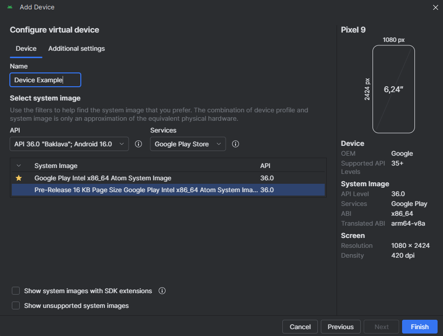

# Como preparar seu app Flutter para a nova política de 16KB do Android (Google Play 2025)

Recentemente precisei ajustar um app Flutter para atender à nova exigência do Google Play sobre **16KB page size**.

Neste artigo, apresento um guia direto ao ponto, mostrando o problema, os passos para reproduzi-lo e, o mais importante, a solução definitiva para ajustar seu aplicativo.

## O problema


A partir de **1º de novembro de 2025**, o **Google Play só aceitará apps que rodem em dispositivos Android configurados com tamanho de página de memória de 16 KB**.

O impacto é direto nas bibliotecas **nativas (`.so`)** que seu app utiliza. Se uma dessas bibliotecas foi compilada esperando um alinhamento de apenas *4 KB (0x1000)*, ela falhará em dispositivos modernos de 16 KB. O resultado? Seu app pode travar na inicialização com erros como *native library not loaded* ou *couldn't map segment*.

No Flutter, esse risco é alto, já que muitas dependências populares — *como leitores de PDF, bibliotecas gráficas ou o Sentry* — incluem esses arquivos .so e podem ainda não estar atualizadas.

## Como Reproduzir o Problema

Antes de arriscar uma rejeição na Google Play, o ideal é simular o ambiente que causa o erro. A forma mais simples é criar um emulador Android que já venha configurado com suporte a 16 KB page size.

###  Criando um emulador para teste: Passos no Android Studio

1. No menu de ferramentas, vá em Tools > AVD Manager.

2. Clique em Create Virtual Device....

3. Escolha um hardware (como o Pixel 9, por exemplo) e clique em Next.

4. Na tela de seleção de imagem de sistema (System Image), procure e selecione uma imagem que contenha "16 KB Page Size" em seu nome. Elas estão disponíveis para Android 15 (API 35) e superiores.

5. Como mostrado na imagem abaixo, o nome é bem explícito: Pre-Release 16 KB Page Size Google Play...

6. Clique em Next e Finish para criar o emulador.

Ao rodar seu aplicativo neste emulador, se ele tiver alguma biblioteca nativa incompatível, o app irá travar na inicialização, reproduzindo exatamente o erro que ocorreria em um dispositivo físico.


---

## Os Possíveis Erros: O Alerta, o Crash e o Fechamento

Ao rodar seu aplicativo no emulador de 16 KB, a incompatibilidade pode se manifestar de algumas formas diferentes. O importante é saber que todas elas indicam o mesmo problema de raiz.

### 1. O Alerta de Compatibilidade

Este é o cenário mais "amigável" e exatamente o que a imagem abaixo mostra. O sistema operacional do emulador detecta a incompatibilidade antes de travar e exibe um alerta claro para o desenvolvedor.

A mensagem diz:

> "This app isn't 16 KB compatible. ELF alignment check failed. This app will be run using page size compatible mode. For best compatibility, please recompile the application with 16 KB support."

Isso significa que o emulador tentará forçar a execução do app, mas ele **não está aprovado** e será rejeitado pela Google Play ou falhará em dispositivos reais.



### 2. O Crash com Erro

Esta é a falha "clássica". O sistema tenta carregar a biblioteca nativa (`.so`), não consegue devido ao alinhamento incorreto e o aplicativo quebra. Ao inspecionar o Logcat, você encontrará um erro fatal explícito, como:

```
java.lang.UnsatisfiedLinkError: couldn't map segment from shared object
```

### 3. O App Simplesmente Fecha

Em alguns casos, especialmente em builds de produção (`release`), o app pode simplesmente fechar no momento da inicialização sem exibir uma mensagem de erro visível para o usuário. A causa é a mesma, mas o diagnóstico exige uma análise mais profunda dos logs do dispositivo.

---

## A Solução: Passo a Passo

Para resolver o problema, você precisa fazer três ajustes principais nos arquivos de configuração do seu módulo Android.

### 1\\. Habilite o Suporte a 16 KB

No arquivo `android/gradle.properties`, adicione a seguinte linha no final do arquivo. Esta é a instrução principal que ativa a compilação com suporte a 16 KB.

```properties
android.enable16kPages=true
```

### 2\\. Configure a Versão do Java

No arquivo `android/app/build.gradle`, garanta que seu projeto está configurado para compilar usando no mínimo **Java 11** (a recomendação é **Java 17**).

```gradle
android {
    // ... outras configurações

    compileOptions {
        sourceCompatibility JavaVersion.VERSION_17
        targetCompatibility JavaVersion.VERSION_17
    }

    kotlinOptions {
        jvmTarget = JavaVersion.VERSION_17.toString()
    }
}
```

### 3\\. Especifique a Versão do NDK

Ainda no `android/app/build.gradle`, dentro do bloco `android {}`, especifique uma versão do NDK (Native Development Kit) igual ou superior à `26.1.10909125`. **Neste exemplo, estou utilizando a `27.0.12077973`**, que é uma das mais recentes disponíveis no Android Studio.

```gradle
android {
    // ... outras configurações

    ndkVersion "27.0.12077973"
}
```

Com essas três configurações aplicadas, seu projeto estará preparado para compilar as bibliotecas nativas com o alinhamento correto.

---

## Encontrando as Bibliotecas Incompatíveis

Com o ambiente de build preparado, a parte crítica agora é investigar as bibliotecas nativas. Precisamos identificar exatamente quais arquivos `.so` estão desalinhados. Fazer isso manualmente em um projeto grande seria inviável.

Para resolver isso, **montei um script que automatiza a extração e a auditoria**, gerando um relatório de quais bibliotecas precisam de atualização.

### Passo 1: Gere e Extraia o App Bundle

Primeiro, precisamos do artefato final do seu aplicativo. Rode os seguintes comandos no terminal, na raiz do seu projeto Flutter:

```bash
# Limpa builds antigos
flutter clean

# Gera o App Bundle de produção
flutter build appbundle --release

# Cria uma pasta para extrair o conteúdo
mkdir aab_out

# Extrai os arquivos do .aab para a pasta criada
tar -xvf build/app/outputs/bundle/release/app-release.aab -C aab_out
```

### Passo 2: Use o Script de Verificação

Agora, crie um arquivo chamado `check_pagesize.bat` na raiz do seu projeto e cole o código abaixo.

#### Script `check_pagesize.bat`

```bat
@echo off
setlocal enabledelayedexpansion

:: ------------------- CONFIGURAÇÃO NECESSÁRIA -------------------
:: Ajuste o caminho abaixo para apontar para o seu llvm-readelf.exe
:: Ele fica dentro da pasta do NDK que você instalou.
set READELF="C:\\Users\\<SEU_USUARIO>\\AppData\\Local\\Android\\Sdk\\ndk\\<NDK_VERSION>\\toolchains\\llvm\\prebuilt\\windows-x86_64\\bin\\llvm-readelf.exe"

:: <SEU_USUARIO> = O nome do seu usuário no Windows.
:: <NDK_VERSION> = A versão do NDK que você está usando (ex: 27.0.12077973).
:: ---------------------------------------------------------------

:: Define o caminho onde as bibliotecas de 64 bits foram extraídas
set LIBPATH=aab_out\\base\\lib\\arm64-v8a

:: Define o nome do arquivo de saída
set OUTPUT=relatorio_alinhamento.txt

echo Verificando alinhamento das bibliotecas em %LIBPATH% > %OUTPUT%
echo ============================================================= >> %OUTPUT%

for %%F in (%LIBPATH%\\*.so) do (
    echo. >> %OUTPUT%
    echo ====== Analisando: %%~nxF ====== >> %OUTPUT%
    %READELF% -l "%%F" | findstr "LOAD" >> %OUTPUT%
)

echo.
echo Concluido O relatorio foi salvo em %OUTPUT%
```

**Importante:** Antes de rodar, **ajuste a variável `READELF`** no script para o caminho exato onde o `llvm-readelf.exe` está localizado na sua máquina, dentro da pasta do NDK.

> **Observação**
>
> Este script foi desenvolvido e testado especificamente para o ambiente **Windows**. Para garantir a execução correta, certifique-se de rodá-lo no **Prompt de Comando (cmd.exe)**, e não no PowerShell, pois podem ocorrer erros na interpretação dos comandos.
>
> Para ambientes Linux ou macOS, seria necessário criar um script *shell* (`.sh`) equivalente.

### 3. Interpretando os Resultados (O Jeito Fácil com IA)

Execute o script `check_pagesize.bat`. Ele irá gerar um arquivo chamado `relatorio_alinhamento.txt`.

Com o `relatorio_alinhamento.txt` em mãos, o próximo passo é a análise. Você poderia fazer isso manualmente, mas para uma análise mais rápida, inteligente e completa, podemos delegar essa tarefa a uma Inteligência Artificial.

#### Usando um Prompt para Análise Automática

Para isso, preparei um prompt completo e bem estruturado. A ideia é fornecer o contexto e os dados necessários para que a IA possa realizar um diagnóstico preciso.

> Copie todo o conteúdo da caixa de texto abaixo, preencha as seções indicadas com os dados do seu projeto e cole na sua ferramenta de IA preferida (Gemini, ChatGPT, Grok etc.).

```txt
# Análise de Conformidade 16 KB Page Size para App Flutter

## CONTEXTO
Estou preparando meu aplicativo Flutter para a nova política do Google Play (16 KB page size), que se torna obrigatória em 01/11/2025. Usei um script para gerar um relatório de alinhamento de memória de todas as bibliotecas nativas (.so) do meu projeto.

## TAREFA
Analise os dois arquivos fornecidos abaixo (o relatório de alinhamento e as dependências do projeto) e forneça um diagnóstico completo e um plano de ação.

---

## ARQUIVO 1: Relatório de Alinhamento (`relatorio_alinhamento.txt`)

<cole aqui o conteúdo completo do seu relatorio_alinhamento.txt>

---

## ARQUIVO 2: Dependências do Projeto (`pubspec.yaml`)

<cole aqui a lista de dependências do seu projeto>

---

## FORMATO DA RESPOSTA ESPERADA
Por favor, estruture sua resposta exatamente da seguinte forma:

1.  **Bibliotecas Conformes:** Liste todos os arquivos `.so` com alinhamento `0x4000` (16 KB) ou superior.
2.  **Bibliotecas Inconformes:** Liste todos os arquivos `.so` com alinhamento `0x1000` (4 KB). Se não houver, informe isso.
3.  **Origem das Bibliotecas:** Para cada `.so` listado, identifique sua origem mais provável (Flutter Engine, NDK, ou um pacote específico do `pubspec.yaml`).
4.  **Plano de Ação:** Se houver bibliotecas inconformes, sugira ações corretivas claras para cada uma (ex: "Atualizar o pacote `sentry_flutter` para a versão `X.Y.Z` ou superior").
5.  **Conclusão Final:** Diga de forma clara se o aplicativo está PRONTO ou NÃO PRONTO para a nova política do Google Play.
```

Ao usar este prompt, a IA não apenas apontará os problemas, mas também conectará cada biblioteca `.so` à sua dependência correspondente e oferecerá um plano de ação claro, economizando horas de pesquisa manual.

---

## 4. Corrigindo as Dependências

Se a sua análise apontou bibliotecas com alinhamento `0x1000` (4 KB), é hora de corrigir. Siga esta ordem de prioridade para resolver os problemas, do mais simples ao mais complexo.

### Passo 1: Garanta a Base do Ambiente de Build

Antes de culpar uma dependência específica, certifique-se de que seu ambiente de build está 100% correto. Muitas vezes, apenas isso já resolve problemas com bibliotecas de sistema.

* **A Causa:** Ferramentas de compilação desatualizadas (como o NDK) podem gerar bibliotecas nativas com o alinhamento antigo.
* **A Solução:** Garanta que você seguiu os passos da seção "A Solução: Passo a Passo". A atualização para um **NDK recente (versão 26+)** é o ponto mais crítico aqui.
* **Dica:** Se a biblioteca problemática for a `libc++_shared.so`, a causa é quase sempre um NDK desatualizado. Apenas atualizá-lo no `build.gradle` deve resolver.

### Passo 2: Investigue e Atualize os Pacotes do Flutter

Se, mesmo com o ambiente correto, alguma biblioteca de pacote continua inconforme, é hora de investigar no `pub.dev`.

* **A Causa:** O pacote que você usa no Flutter pode incluir uma biblioteca nativa (`.so`) pré-compilada que ainda não foi atualizada pelo mantenedor.
* **A Solução:** Siga este processo de investigação para cada dependência suspeita (que a análise da IA apontou):

    1.  **Acesse o `pub.dev`:** Vá para a página do pacote (ex: `https://pub.dev/packages/sentry_flutter`).
    2.  **Verifique o `Changelog`:** Esta é sua fonte de verdade. Na aba **Changelog**, procure por menções a `16KB`, `pagesize`, `Android 15`, `API 35` ou atualizações do NDK. Mantenedores de pacotes populares geralmente destacam essa correção.
    3.  **Analise as Issues no GitHub:** Se o changelog não for claro, vá para o repositório do projeto (na aba **Repository**) e verifique as *Issues*. É provável que outros desenvolvedores já tenham reportado o problema.

### Passo 3: Decida o que Fazer com o Pacote

Após a investigação, você terá um dos cenários abaixo:

* **Cenário 1: Existe uma Versão Corrigida**
    Se o changelog ou uma issue confirmar que uma versão mais recente resolve o problema, a solução é fácil: atualize a versão do pacote no seu `pubspec.yaml` e rode `flutter pub get`.

* **Cenário 2: O Pacote está Desatualizado ou Abandonado**
    Se o mantenedor não lançou uma correção, sua melhor opção é **encontrar uma alternativa**.

### Passo Final: Verifique Novamente

Após aplicar as correções (seja atualizando o NDK ou os pacotes), **rode o processo de auditoria novamente**:
`flutter clean` -> `flutter build appbundle` -> extraia e execute o script.

Seu objetivo é ter um `relatorio_alinhamento.txt` sem nenhuma biblioteca com alinhamento `0x1000`.

---

## Conclusão

A migração para o page size de 16 KB pode parecer intimidante, mas é um processo totalmente gerenciável com as ferramentas certas. O prazo final de 1º de novembro de 2025 se aproxima, e a chave para a conformidade é a auditoria: identificar e corrigir qualquer biblioteca nativa (.so) ainda presa no antigo alinhamento de 4 KB (0x1000).

Se a sua verificação final mostra que todas as dependências estão em 0x4000 (16 KB) ou superior, parabéns, seu aplicativo está pronto. Como recomendação final, adote o emulador de 16 KB em seus testes e incorpore o script de auditoria em sua rotina de release. Essa prática proativa garantirá que seu app permaneça sempre em conformidade.

---

> *Esse artigo é fruto da minha experiência real resolvendo esse problema em produção. Se você também encontrou dificuldades com a migração para 16 KB, compartilhe nos comentários!*